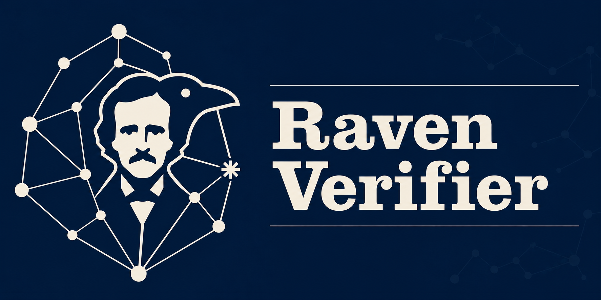

<p align="center">
  
</p>

VS Code integration for the [Raven intermediate verification language](https://github.com/nyu-acsys/raven) and verification tool.

New to Raven? **[nyu-acsys.github.io/raven](https://nyu-acsys.github.io/raven/)** introduces the language and what it is for.

## Features

- **Syntax Highlighting**: Proper highlighting for `.rav` files.
- **Verification**: Automatic verification as you edit, with error diagnostics.
- **Manual Verification**: Trigger verification manually with `Cmd+Shift+R`.
- **Diagnostics**: Errors and warnings shown directly in the editor.

## Prerequisites

None. This extension bundles the Raven verifier and Z3 for your platform (Linux x64/arm64, macOS x64/arm64, Windows x64), so nothing needs to be installed separately.

## Installation

You can install this extension directly from the [Marketplace](https://marketplace.visualstudio.com/items?itemName=nyu-acsys.raven-verifier), or run the following command in VS Code:

```bash
code --install-extension nyu-acsys.raven-verifier
```

## Usage

* **Verification**: Verification runs automatically as you edit — no need to save first.
* **Manual Verification**: You can trigger verification manually by pressing `Cmd+Shift+R` (Mac) or `Alt+Shift+R` (Windows/Linux) when editing a `.rav` file.

## Staying up to date

The extension ships with a working verifier, and also keeps up with new Raven releases on its own, so you get a new verifier without waiting for a new extension. It checks at most once a day and asks before downloading anything; `Raven: Show Verifier Version` says what is currently in use.

To turn this off, set `ravenServer.updateChannel` to `bundled` (or run `Raven: Use Bundled Verifier`). To pin a particular Raven release, set the channel to `tag` and name it in `ravenServer.ravenVersion`.

## Opening `.rav` files from the file manager

Installing this extension teaches VS Code what a `.rav` file is, but it cannot tell your
operating system — nothing an extension installs is allowed to change your system's file
associations. So double-clicking a `.rav` file in Explorer, Finder or your file manager
won't open VS Code until you say so once.

### Windows

Right-click any `.rav` file → **Open with** → **Choose another app** → pick Visual Studio
Code → tick **Always use this app to open .rav files**.

Equivalently, in PowerShell. This writes under `HKCU`, so there is no administrator
prompt; adjust the path if VS Code is installed system-wide, where it lives under
`C:\Program Files\Microsoft VS Code`:

```powershell
$code = "$env:LOCALAPPDATA\Programs\Microsoft VS Code\Code.exe"
New-Item 'HKCU:\Software\Classes\.rav' -Force -Value 'VSCode.rav' | Out-Null
New-Item 'HKCU:\Software\Classes\VSCode.rav' -Force -Value 'Raven source file' | Out-Null
New-Item 'HKCU:\Software\Classes\VSCode.rav\shell\open\command' -Force `
    -Value "`"$code`" `"%1`"" | Out-Null
```

### macOS

Select a `.rav` file in Finder → **File ▸ Get Info** (`Cmd+I`) → under **Open with:**
choose Visual Studio Code → click **Change All…**.

If VS Code isn't in the dropdown, pick **Other…**, set the **Enable:** filter to *All
Applications*, and select it from `/Applications`.

### Linux

`.rav` is not a MIME type any distribution knows, so it needs defining first — otherwise
the only type a file manager can offer to reassign is `text/plain`, and changing that
would redirect every plain-text file to VS Code.

```bash
mkdir -p ~/.local/share/mime/packages
cat > ~/.local/share/mime/packages/raven.xml <<'EOF'
<?xml version="1.0" encoding="UTF-8"?>
<mime-info xmlns="http://www.freedesktop.org/standards/shared-mime-info">
  <mime-type type="text/x-raven">
    <comment>Raven source file</comment>
    <sub-class-of type="text/plain"/>
    <glob pattern="*.rav"/>
  </mime-type>
</mime-info>
EOF
update-mime-database ~/.local/share/mime
```

With the type defined, either right-click a `.rav` file in your file manager and set
Visual Studio Code as the default application, or do it from the terminal:

```bash
xdg-mime default code.desktop text/x-raven
```

The name to use there depends on how VS Code was installed: `code.desktop` for the
official `.deb`/`.rpm`, `code_code.desktop` for the Snap, `com.visualstudio.code.desktop`
for the Flatpak, `code-insiders.desktop` or `codium.desktop` for those builds. Snap and
Flatpak keep their desktop files outside `/usr/share/applications`, so look everywhere
XDG does rather than in one directory:

```bash
for dir in "${XDG_DATA_HOME:-$HOME/.local/share}" ${XDG_DATA_DIRS//:/ }; do
    ls "$dir/applications" 2>/dev/null
done | grep -i code | sort -u
```

Then confirm it took, and restart your file manager if it is still showing the old
association:

```bash
xdg-mime query filetype some-file.rav   # text/x-raven
xdg-mime query default text/x-raven     # code.desktop
```

Check the first one against a file with something in it. Content sniffing outranks the
glob for empty files, so a `.rav` you just created with `touch` reports as
`application/x-zerosize` even when everything is set up correctly.

## Learning Raven

The [**Raven Tutorial**](https://nyu-acsys.github.io/raven/tutorial/) is a from-scratch introduction written around this extension: [Part 0](https://nyu-acsys.github.io/raven/tutorial/00-getting-started/) starts from the extension you have just installed and a first `.rav` file, and a single running example grows from a plain value into a concurrent data structure. Every listing in it is real, checked source.

## Configuration

This extension provides the following settings:

* `ravenServer.maxNumberOfProblems`: Controls the maximum number of problems produced by the server.
* `ravenServer.trace.server`: Traces the communication between VS Code and the language server.
* `ravenServer.executablePath`: Path to the Raven executable. Leave empty to let the extension choose one.
* `ravenServer.updateChannel`: `stable` (follow Raven releases), `tag` (use the release named by `ravenServer.ravenVersion`), or `bundled` (only ever use the shipped verifier).
* `ravenServer.ravenVersion`: The release tag to use on the `tag` channel, e.g. `v1.2.0`.
* `ravenServer.checkForUpdates`: Whether to check daily for a newer verifier.
* `ravenServer.showGutterIcons`: Mark lines carrying a diagnostic with an icon in the editor's gutter.
* `ravenServer.highlightRelatedLocations`: Underline a diagnostic's related locations in the editor.

## Developing Raven or This Extension

Working on Raven itself and want to verify against a local build instead of the bundled binary, or want to build this extension from source? See the [GitHub repo](https://github.com/nyu-acsys/raven-lang#first-usage).
